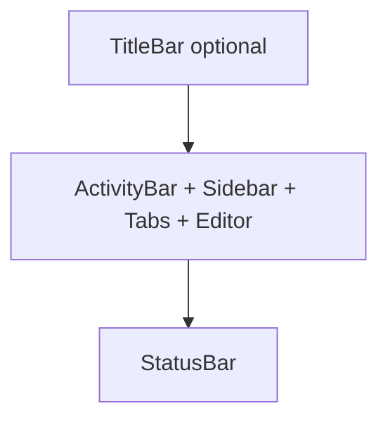

# Custom TitleBar — Design

**Date:** 2026-08-07  
**Status:** Ready for review  
**Repo:** `/Users/melon/Projects/melon/vscode-shell`  
**Extends:** [2026-08-07-vscode-shell-design.md](./2026-08-07-vscode-shell-design.md)

## Problem

The starter (and future consumers) still use the native window title bar. That doubles chrome on macOS once a VS Code–like shell is present, and blocks a continuous custom top strip (traffic lights over content, app title, actions).

We need a reusable **TitleBar** in `@vscode-shell/ui` and a **Workbench** slot so apps can opt into a full-width custom title strip. Window decoration (overlay / hidden title) stays in the Tauri app config — the library remains free of Tauri APIs.

## Goals

1. Add `TitleBar` with `center` and `right` slots (`ReactNode`).
2. Extend `Workbench` with optional `titleBar` as a **full-width top row** above ActivityBar.
3. Document drag / no-drag DOM conventions for Tauri.
4. Wire `apps/starter` on macOS with overlay title bar; move theme toggle into `TitleBar.right`.
5. Keep `@vscode-shell/ui` free of `@tauri-apps/*` and business logic.

## Non-Goals

- Drawing minimize / maximize / close buttons in the library
- Platform detection or Tauri API calls inside `@vscode-shell/ui`
- Custom traffic-light styling
- Menu bar (File / Edit), double-click-to-maximize behavior as a library feature
- Full Windows / Linux window-button theming (TitleBar may still render; decoration strategy is app-owned)
- Migrating os-kit or cb-monitor

## Decisions

| Topic | Choice |
|-------|--------|
| Responsibility split | Library = UI slots + layout; app/docs = Tauri `titleBarStyle` / `hiddenTitle` |
| Center content | `center?: ReactNode` (not a dedicated `title: string`) |
| Drag region | Large drag on TitleBar root; interactive controls marked no-drag |
| Workbench integration | Optional `titleBar` prop; full-width strip above the ActivityBar row |
| Approach | TitleBar + `Workbench.titleBar` (not “TitleBar only outside Workbench”, not platform-aware mega-component) |

## Architecture

```text
┌──────────────── TitleBar（full width）──────────────┐
│ [traffic inset]     center              right       │
├────┬────────────────────────────────────────────────┤
│Act │ Sidebar │ PageTabs                             │
│Bar │         │ Editor                               │
├────┴────────────────────────────────────────────────┤
│ StatusBar                                           │
└─────────────────────────────────────────────────────┘
```



### Boundary

| In `@vscode-shell/ui` | Out (starter / consumer docs) |
|----------------------|-------------------------------|
| `TitleBar`, tokens, layout classes | `tauri.conf.json` overlay settings |
| `data-tauri-drag-region` / no-drag CSS | Real window controls if needed |
| `Workbench.titleBar` slot | Product title, theme actions, menus |

## Component API

### TitleBar

```ts
type TitleBarProps = {
  /** Middle area; text or any ReactNode */
  center?: ReactNode
  /** Right actions (theme toggle, etc.) */
  right?: ReactNode
  className?: string
}
```

- No dedicated `title: string`; pass text via `center`.
- No built-in window chrome buttons.
- No Tauri imports.

### Workbench

```ts
type WorkbenchProps = {
  titleBar?: ReactNode  // new; omit / undefined = previous layout
  activityBar?: ReactNode
  sidebar?: ReactNode
  tabs?: ReactNode
  statusBar?: ReactNode
  children?: ReactNode
}
```

### Starter usage

```tsx
<Workbench
  titleBar={
    <TitleBar
      center={<span>VS Code Shell</span>}
      right={<button type="button" onClick={toggleTheme}>…</button>}
    />
  }
  activityBar={…}
  sidebar={…}
  tabs={…}
  statusBar={…}
>
  {editor}
</Workbench>
```

Theme toggle lives in `TitleBar.right` only (remove from StatusBar demo).

## Layout and drag

### Layout

- `titleBar` is the first child of `.vsc-workbench`, spanning the full window width.
- Height via token `--vscode-titlebar-height` (~36–38px).
- Colors via title-bar tokens aligned with VS Code Light+ / Dark+ (reuse or add `--vscode-titleBar-*` as needed).
- Three zones: left inset | center | right.
  - **Left:** padding only. Token `--vscode-titlebar-traffic-width` default ~`78px` for macOS overlay traffic lights. Consumers without overlay set this to `0` (CSS variable override or documented class).
  - **Center:** horizontally centered; overflow `ellipsis` when needed.
  - **Right:** end-aligned flex row with gap for controls.

### Drag conventions

| Region | Behavior |
|--------|----------|
| TitleBar root | `data-tauri-drag-region` (draggable) |
| Interactive controls in `center` / `right` | Wrapper with `data-tauri-drag-region="false"` and/or class `vsc-titlebar__no-drag` (`-webkit-app-region: no-drag`) |
| Plain text in `center` | Remains draggable (no no-drag wrapper) |

Library documents the attributes/classes; enabling overlay is app configuration.

## Tauri and starter

### Starter window (macOS-first)

In `apps/starter/src-tauri/tauri.conf.json` `app.windows[0]`:

```json
"titleBarStyle": "Overlay",
"hiddenTitle": true
```

- System traffic lights overlay the content top-left; library inset avoids overlap.
- Windows / Linux: same TitleBar markup is fine in v1; if native title bar remains, omit `titleBar` or set traffic width to `0` per docs.
- Do not implement JS window buttons in v1.

### Docs

- README: overlay config is required for custom title bar; importing `TitleBar` alone does not hide the system bar.
- Document drag / no-drag patterns for consumers.

## Testing

| Layer | Scope |
|-------|--------|
| `packages/shell` | Unit: render `center` / `right`; drag attribute on root; Workbench with and without `titleBar` |
| `apps/starter` | Manual macOS: no double title bar; drag window; theme control clickable; shell regression |
| CI | Existing build + shell unit tests; no Tauri E2E requirement |

## Error handling

| Case | Behavior |
|------|----------|
| `titleBar` omitted | Layout identical to pre-TitleBar Workbench |
| Empty `center` / `right` | Render zones; no crash |
| Missing overlay config | Native + custom bars may both show; README warns |

Prefer types over runtime throws.

## Acceptance criteria

1. Optional `Workbench.titleBar`; omitting it preserves current layout.
2. `@vscode-shell/ui` has no `@tauri-apps/*` dependency.
3. Starter on macOS with overlay: custom title bar drags the window; interactive controls remain clickable.
4. README documents overlay settings and drag / no-drag conventions.
5. Shell unit tests cover TitleBar + Workbench slot smoke cases.

## Implementation notes (for the plan phase)

- Export `TitleBar` from package `index.ts`.
- Rebuild `styles.css` into `dist` with existing tsup + copy flow.
- Prefer minimal Workbench DOM change: wrap or prepend `titleBar` without restructuring sidebar/main unless CSS requires it.
- After implementation, follow writing-plans → TDD for the shell package where practical.
