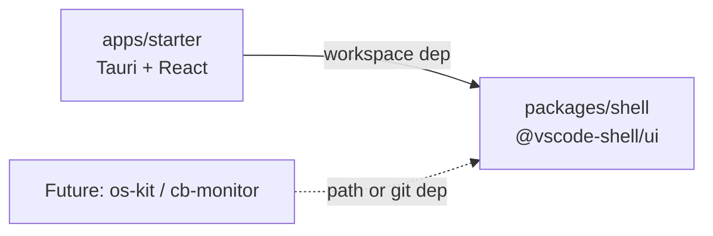
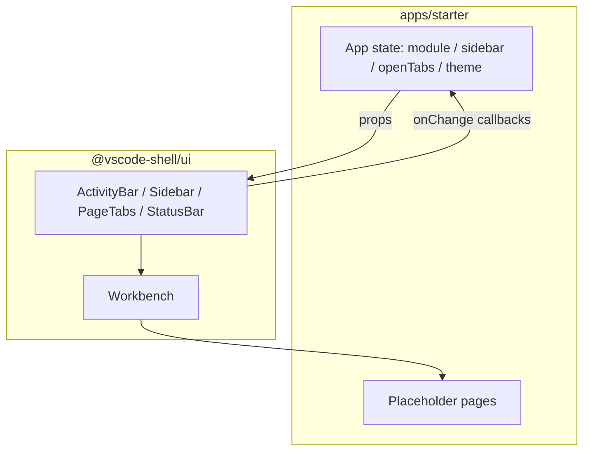

# VS Code Shell — Shared Library + Starter Design

**Date:** 2026-08-07  
**Status:** Ready for review  
**Repo:** `/Users/melon/Projects/melon/vscode-shell` (standalone; not inside os-kit or cb-monitor)

## Problem

Two Tauri + React desktop apps — `os-kit` and `cb-monitor/desktop` — each ship a VS Code–like chrome (ActivityBar, Sidebar, PageTabs, StatusBar) and overlapping color tokens. The look has matured in os-kit (CSS variables, Light+/Dark+), while cb-monitor still hard-codes dark Tailwind colors and keeps more prop-driven shell pieces.

We want one reusable **shell library** plus a **starter desktop app**, so a third project can start from a real scaffold instead of copying layout files. Existing apps are **out of scope for v1** (zero migration).

## Goals

1. Ship `@vscode-shell/ui`: design tokens + prop-driven chrome + `Workbench` layout.
2. Ship `apps/starter`: Tauri + React app that depends on the workspace package and demonstrates navigation, multi-tabs, and theme toggle.
3. Support Light+ and Dark+ via CSS variables.
4. Keep the library free of business logic, routers, Tauri APIs, and Ant Design / Flowbite overrides.
5. Document how another repo can consume the package via path or git dependency later.

## Non-Goals (v1)

- Migrating os-kit or cb-monitor
- npm publish / private registry
- CLI (`create-vscode-shell`)
- Ant Design or Flowbite theme bridges
- Codicon icon font (consumers pass `ReactNode` icons)
- System color-scheme auto-switch
- Playwright / full E2E in CI
- Splash screens or app-specific StatusBar business widgets

## Decisions Already Made

| Topic | Choice |
|-------|--------|
| Deliverable | Shared shell library **+** starter template (CLI later) |
| Hosting | New standalone git repo (pnpm monorepo) |
| Theme | Light+ and Dark+ (CSS variables) |
| v1 success | New repo builds; starter `tauri dev` runs; no changes to existing apps |
| Starter form | Tauri + React desktop app |
| Styling in library | Self-contained CSS (variables + component classes); not tied to Tailwind major version |

## Architecture

```
vscode-shell/
├── packages/
│   └── shell/                 # @vscode-shell/ui
│       ├── src/
│       │   ├── tokens/        # CSS variables, scrollbar, base
│       │   ├── components/    # Workbench, ActivityBar, Sidebar, PageTabs, StatusBar
│       │   ├── theme.ts       # setTheme / getTheme helpers
│       │   └── index.ts
│       └── package.json
├── apps/
│   └── starter/               # Tauri + React consumer
│       ├── src/
│       ├── src-tauri/
│       └── package.json
├── pnpm-workspace.yaml
├── package.json
└── README.md
```



### Boundary

| In `@vscode-shell/ui` | Out (app / later) |
|----------------------|-------------------|
| `--vscode-*` tokens, `.dark` contract | Route tables, module catalogs |
| Chrome primitives (props / slots) | Tauri events, APIs, env switchers |
| `Workbench` layout composition | Ant Design / ProTable global CSS |
| `setTheme` / `getTheme` | Real product pages |
| peerDependency: `react` | Flowbite, business StatusBar |

## Component API

All chrome is **controlled**. The library does not own open-tabs state, routing, or persistence.

### Workbench

```tsx
<Workbench
  activityBar={<ActivityBar ... />}
  sidebar={<Sidebar ... />}   // null hides sidebar
  tabs={<PageTabs ... />}
  statusBar={<StatusBar ... />}
>
  {editorContent}
</Workbench>
```

Layout: `ActivityBar | (Sidebar + Tabs + Editor)` over `StatusBar`.

### ActivityBar

```ts
type ActivityItem = {
  id: string
  label: string
  icon: ReactNode
  position?: 'top' | 'bottom' // default top
}

type ActivityBarProps = {
  items: ActivityItem[]
  activeId: string
  onChange: (id: string) => void
  logo?: ReactNode
  onLogoClick?: () => void
}
```

### Sidebar

```ts
type SidebarItem = {
  id: string
  label: string
  icon?: ReactNode
  children?: SidebarItem[]
}

type SidebarProps = {
  title?: string
  items: SidebarItem[]
  activeId: string
  onChange: (id: string) => void
  width?: number // default 192
  footer?: ReactNode
}
```

### PageTabs

Multi-tab (aligned with os-kit), not single static label:

```ts
type PageTab = {
  id: string
  title: string
  icon?: ReactNode
  closable?: boolean // default true
}

type PageTabsProps = {
  tabs: PageTab[]
  activeId: string
  onSelect: (id: string) => void
  onClose?: (id: string) => void
}
```

### StatusBar

Shell + slots only:

```ts
type StatusBarProps = {
  left?: ReactNode
  center?: ReactNode
  right?: ReactNode
  showThemeToggle?: boolean
  theme?: 'light' | 'dark'
  onThemeChange?: (theme: 'light' | 'dark') => void
}
```

Theme toggle invokes `onThemeChange` only. The app (or `setTheme`) applies the `dark` class.

### Public export

```ts
export { Workbench, ActivityBar, Sidebar, PageTabs, StatusBar }
export { setTheme, getTheme }
export type { ActivityItem, SidebarItem, PageTab, /* props types */ }
// import '@vscode-shell/ui/styles.css'
```

### Data flow (starter)



## Theme and CSS

### Tokens

- `:root` — VS Code Light+
- `.dark` — VS Code Dark+
- Prefix: `--vscode-*` covering editor, sidebar, activitybar, statusbar, hover, selected, border, text (primary / secondary / highlight), success, error, input, table, modal

Token values should match the matured set in os-kit’s `src/index.css` (copy as starting point; trim Ant-only bridges).

### Delivery

- Ship `styles.css` from the package (tokens + scrollbar + component classes such as `.vsc-activity-bar`).
- Component styles use **CSS variables + library classes**, not the consumer’s Tailwind version.
- Optional docs: sample Tailwind v3 `theme.extend.colors` and Tailwind v4 `@theme` mappings for app pages. Not required to use the chrome.

### Theme helpers

```ts
setTheme('light' | 'dark')  // toggles `.dark` on documentElement
getTheme(): 'light' | 'dark'
```

Invalid input: ignore or fall back to `dark`.

### Starter defaults

- Vite + React + Tailwind 4 for **app** pages
- Import `@vscode-shell/ui/styles.css` at entry
- Default theme: `dark`
- No react-router required in v1 (local state is enough)

## Starter behavior

| Area | v1 behavior |
|------|-------------|
| ActivityBar | 2–3 demo modules (e.g. Home / Explorer / Settings); at least one `bottom` item |
| Sidebar | Menu switches with module; Settings shows nested `children` |
| PageTabs | Open / select / close; home tab `closable: false` |
| Editor | Placeholder pages using tokens (title, short copy, sample card) |
| StatusBar | left: ready text; right: theme toggle + version stub |
| Tauri | Minimal window config; no custom Rust commands |

## Error handling

| Case | Behavior |
|------|----------|
| `activeId` not in `items` | No crash; no active highlight (app should keep ids valid) |
| `closable` tab but no `onClose` | Hide close control |
| `sidebar={null}` | Layout without sidebar column |
| Missing `styles.css` import | Components render unstyled; README calls this out |

Prefer TypeScript types over runtime throws.

## Testing

| Layer | v1 |
|-------|----|
| `packages/shell` | Unit/smoke: render items, `onChange` / `onClose`, `setTheme` class toggle |
| `apps/starter` | Manual: `tauri dev` — navigate, tabs, light/dark |
| CI (optional) | `pnpm -r build` + shell unit tests; Tauri build not required to pass CI in v1 |

## Acceptance criteria

1. `pnpm i && pnpm --filter @vscode-shell/ui build` succeeds.
2. `pnpm --filter starter tauri dev` opens a desktop window with full chrome and working theme toggle. (`apps/starter/package.json` `name` must be `starter` so the filter matches.)
3. Root README documents workspace layout and how to depend on `packages/shell` from another repo via path or git.

## Implementation notes (for the plan phase)

- Extract token block from os-kit `src/index.css` as the initial `tokens` source; **do not** copy Ant/ProTable override rules.
- Prefer os-kit’s multi-tab `PageTabs` behavior and cb-monitor’s prop-driven ActivityBar shape when implementing API above.
- Keep package `peerDependencies.react` wide enough for React 18 and 19 if practical.
- Defer CLI and npm publish until a second real consumer exists.

## Open naming

Package scope `@vscode-shell/ui` and repo folder `vscode-shell` are working names. Rename before first external publish if needed; not a v1 blocker.
