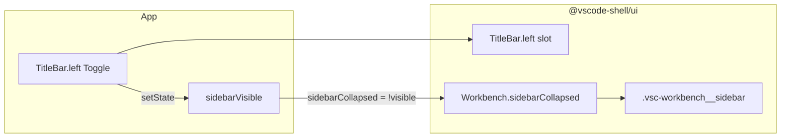

# Sidebar Toggle — Design

**Date:** 2026-08-11  
**Status:** Ready for review  
**Repo:** `/Users/melon/Projects/melon/vscode-shell`  
**Extends:** [2026-08-07-titlebar-design.md](./2026-08-07-titlebar-design.md)

## Problem

Users need a way to show and hide the Sidebar from the custom TitleBar. The control must sit on the **left** of the TitleBar: on macOS immediately after the system traffic lights; on Windows at the far left. Hiding should **collapse width to 0** (DOM kept) with a short CSS transition, not unmount the Sidebar.

## Goals

1. Add `TitleBar.left` slot for app-owned left actions (toggle button).
2. Add `Workbench.sidebarCollapsed` so the sidebar column can animate width to/from 0 while keeping children mounted.
3. Wire starter: `sidebarVisible` state + panel-style toggle icon in `TitleBar.left`.
4. Keep platform inset behavior via existing `--vscode-titlebar-traffic-width` / `platform.ts` (Mac inset, Windows `0`).
5. ActivityBar / tab changes must **not** alter sidebar visibility.

## Non-Goals

- Built-in toggle component inside `@vscode-shell/ui`
- Platform detection or Tauri APIs in the library
- Keyboard shortcut (e.g. Cmd/Ctrl+B)
- Persisting visibility across reloads
- Auto-expanding sidebar when ActivityBar selection changes
- Changing Sidebar internals or ActivityBar API

## Decisions

| Topic | Choice |
|-------|--------|
| Ownership | Library = slots + collapse CSS; App = state + button + icon |
| Hide behavior | Width → 0, DOM retained, CSS transition |
| ActivityBar | Module switch only; does not touch visibility |
| Toggle UI | Panel / sidebar icon (VS Code–like), not hamburger |
| Approach | `TitleBar.left` + `Workbench.sidebarCollapsed` (not absolute-positioned app hack, not Workbench-owned toggle state) |

## Architecture

```text
Mac:     [● ● ●] [Toggle] ........ center ........ [theme] [win?]
Windows: [Toggle] ................ center ........ [theme] [min max close]
```



### Boundary

| In `@vscode-shell/ui` | Out (`apps/starter`) |
|----------------------|----------------------|
| `TitleBar.left`, no-drag on left controls | Toggle button, icon, labels |
| `Workbench.sidebarCollapsed` + collapse CSS | `sidebarVisible` state |
| Existing traffic-width token | Mac/Win inset via `applyTitleBarInsets` |

## Component API

### TitleBar

```ts
type TitleBarProps = {
  /** Left actions after traffic-light inset (e.g. sidebar toggle) */
  left?: ReactNode
  center?: ReactNode
  right?: ReactNode
  className?: string
}
```

- `left` renders inside `.vsc-titlebar__left`, **after** the traffic inset space (flex: inset spacer or padding-left = `--vscode-titlebar-traffic-width`, then controls).
- Interactive nodes in `left` use `vsc-titlebar__no-drag` / `data-tauri-drag-region="false"`.
- Empty `left` keeps current Mac inset-only behavior.

### Workbench

```ts
type WorkbenchProps = {
  titleBar?: ReactNode
  activityBar: ReactNode
  sidebar?: ReactNode | null
  /** When true, sidebar column width collapses to 0 (children stay mounted). */
  sidebarCollapsed?: boolean
  tabs?: ReactNode
  panel?: ReactNode | null
  statusBar?: ReactNode
  children: ReactNode
}
```

- `sidebar == null` → no sidebar column (unchanged).
- `sidebar` set + `sidebarCollapsed === true` → column present with collapsed class; width `0`, `overflow: hidden`, transition on width.
- Default `sidebarCollapsed` = `false`.

### Starter usage

```tsx
const [sidebarVisible, setSidebarVisible] = useState(true)

<Workbench
  titleBar={
    <TitleBar
      left={
        <button
          type="button"
          aria-label={sidebarVisible ? 'Hide Sidebar' : 'Show Sidebar'}
          aria-pressed={sidebarVisible}
          onClick={() => setSidebarVisible((v) => !v)}
        >
          {/* panel / sidebar icon */}
        </button>
      }
      center={<span>VS Code Shell</span>}
      right={…}
    />
  }
  sidebarCollapsed={!sidebarVisible}
  sidebar={<Sidebar … />}
  …
/>
```

## Layout and animation

### TitleBar left

- `.vsc-titlebar__left` becomes a horizontal flex row: height 100%, `flex-shrink: 0`.
- Leading space: `padding-left` or an inert spacer sized to `--vscode-titlebar-traffic-width` (Mac ~78px, Windows 0 via starter).
- Toggle sits immediately after that space (Mac: after traffic lights; Windows: far left with small control padding).
- Controls: align center, `no-drag`.

### Sidebar collapse

- Apply class (e.g. `is-collapsed`) on `.vsc-workbench__sidebar` when `sidebarCollapsed`.
- Animate with **explicit numeric widths** (CSS cannot transition `auto` → `0`): prefer `max-width` (e.g. expanded `max-width: 192px` matching Sidebar default; collapsed `max-width: 0`) plus `overflow: hidden` and `transition: max-width ~150–200ms ease`. Optional `pointer-events: none` when collapsed.
- If a consumer passes a non-default Sidebar `width`, starter/plan may set a matching CSS variable on the column; v1 default = `192px`.
- Do not unmount `<Sidebar />`.

## State and interactions

| Event | Effect |
|-------|--------|
| Click TitleBar toggle | Flip `sidebarVisible` |
| ActivityBar change | Open module/page only; visibility unchanged |
| Tab select/close | Unchanged; visibility unchanged |
| Reload | `sidebarVisible` resets to `true` |

No persistence, no keyboard shortcut in this change.

## Testing

| Layer | Scope |
|-------|--------|
| `TitleBar` unit | Renders `left` content; left interactive region has no-drag |
| `Workbench` unit | `sidebarCollapsed` adds collapsed class / width 0; `false` restores; `sidebar={null}` still hides column |
| `apps/starter` manual | Mac: toggle after traffic lights; Windows: leftmost; transition works; ActivityBar does not reopen/hide |

## Error handling

| Case | Behavior |
|------|----------|
| `left` omitted | Left zone = traffic inset only (current behavior) |
| `sidebarCollapsed` without `sidebar` | No-op (no column) |
| `sidebarCollapsed` + `sidebar={null}` | No column (null wins) |

Prefer types over runtime throws.

## Acceptance criteria

1. `TitleBar` accepts optional `left`; Mac/Windows placement follows traffic-width inset.
2. `Workbench.sidebarCollapsed` collapses sidebar column to width 0 with transition; Sidebar stays mounted.
3. Starter toggle uses a panel-style icon; only that control changes visibility.
4. ActivityBar / tabs do not change `sidebarVisible`.
5. Library remains free of Tauri / platform detection.
6. Unit tests cover TitleBar `left` and Workbench collapse smoke cases.

## Implementation notes (for the plan phase)

- Update `TitleBar.tsx`, `TitleBarProps`, `TitleBar.test.tsx`.
- Update `Workbench.tsx`, `WorkbenchProps`, `Workbench.test.tsx`, `styles.css`.
- Wire `apps/starter/src/App.tsx` only for product state/UI.
- Prefer minimal CSS; reuse existing titlebar no-drag patterns.
- After approval, use writing-plans → implement with TDD where practical.
