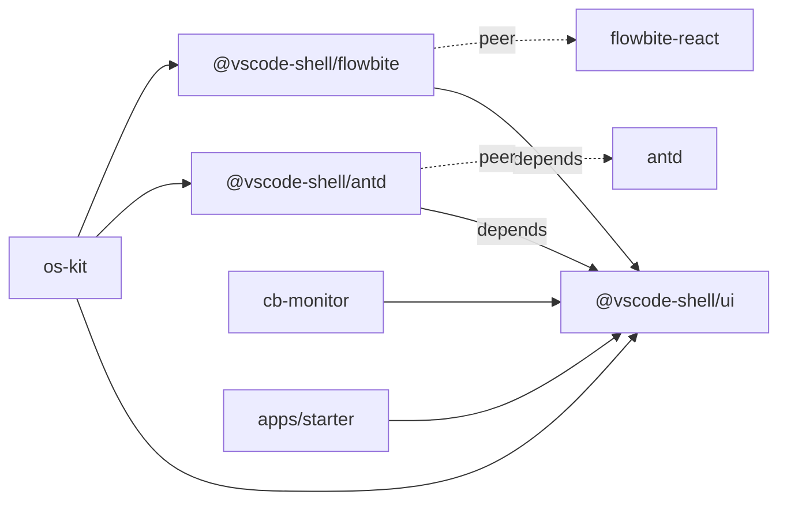

# Publish + Theme Bridges Design

**Date:** 2026-08-12  
**Status:** Ready for review  
**Repo:** `/Users/melon/Projects/melon/vscode-shell`  
**Extends:** [2026-08-07-vscode-shell-design.md](./2026-08-07-vscode-shell-design.md)

## Problem

`@vscode-shell/ui` is adopted by two real apps (`os-kit`, `cb-monitor`), both still on `file:` path dependencies. Version locking and upgrades are painful. os-kit also carries a mature Ant Design 6 + Flowbite theme mapping to `--vscode-*` tokens; that mapping should be reusable instead of copied into every antd/flowbite consumer.

Original v1 deferred npm publish and component-library bridges until a second consumer existed. That gate is now met.

## Goals

1. Publish versioned packages so consumers can pin with semver (or git tags as fallback).
2. Extract os-kit’s proven token-level Ant Design and Flowbite bridges into optional packages.
3. Keep `@vscode-shell/ui` free of `antd` / `flowbite-react` dependencies.
4. Document install, migration, and publish/fallback paths in the root README.

## Non-Goals

- CI auto-publish
- CLI (`create-vscode-shell`)
- Moving os-kit structural CSS overrides (ProTable toolbar, Tabs flex height, titlebar Segmented, etc.) into the library
- Codicon, system color-scheme auto-switch, sidebar persistence / Cmd+B
- Forcing cb-monitor or starter to install bridge packages
- Changing chrome component APIs in this workstream

## Decisions

| Topic | Choice |
|-------|--------|
| Approach | npm-capable packages + optional bridge packages (方案 2) |
| Package set | `@vscode-shell/ui`, `@vscode-shell/antd`, `@vscode-shell/flowbite` |
| Versioning | Synchronized semver across the three packages; start at `0.2.0` |
| Bridge scope | Token / `ThemeConfig` / Flowbite `createTheme` only |
| Publish channel | Prefer public npmjs `@vscode-shell`; fallback private registry or git tag |
| Auto publish | Manual; docs list commands; no CI publish in this phase |

## Architecture

```
vscode-shell/
├── packages/
│   ├── shell/       # @vscode-shell/ui (existing → 0.2.0)
│   ├── antd/        # @vscode-shell/antd (new)
│   └── flowbite/    # @vscode-shell/flowbite (new)
├── apps/
│   └── starter/     # depends on @vscode-shell/ui only
└── CHANGELOG.md
```



### Boundary

| In package | Out (app / later) |
|------------|-------------------|
| `@vscode-shell/ui`: tokens, chrome, `setTheme` | Routes, Tauri, business StatusBar |
| `@vscode-shell/antd`: `createAntTheme`, `--ant-*` CSS var bridge | ProTable / Tabs layout / Segmented titlebar CSS |
| `@vscode-shell/flowbite`: `createFlowbiteTheme` | flowbite Vite plugin, `.flowbite-react` codegen |

## Component / Package API

### `@vscode-shell/antd`

```ts
import { createAntTheme } from '@vscode-shell/antd'
import type { ThemeConfig } from 'antd'
import '@vscode-shell/antd/styles.css'
import '@vscode-shell/ui/styles.css'

type CreateAntThemeOptions = {
  /** Merge override onto the default ThemeConfig (see merge rules below) */
  overrides?: ThemeConfig
}

function createAntTheme(options?: CreateAntThemeOptions): ThemeConfig
```

**Merge rules for `overrides`:** one-level shallow merge at the ThemeConfig root; additionally shallow-merge `token` and each entry under `components`. No deep recursive merge libraries. Unspecified keys keep defaults.

Consumer:

```tsx
<ConfigProvider theme={createAntTheme()}>
  …
</ConfigProvider>
```

Default theme content matches os-kit `src/config/settings.ts` `antSettings.theme`:

- `cssVar: { key: 'ant' }`
- Tokens mapped to `var(--vscode-*)` (text, surfaces, borders, primary/error/success aligned with shell)
- Component tokens: `Menu`, `Table`, `Modal`, `Input`, `Select`, `Button`, `Tabs`

`styles.css` ships only `:root` / `.dark` `--ant-color-*` ↔ `--vscode-*` mappings (from os-kit `src/index.css` Ant var block). No structural `.ant-*` layout overrides.

**peerDependencies:** `antd` (range covering Ant Design 5 and 6 if practical), `react`, `react-dom`  
**dependencies:** `@vscode-shell/ui` (workspace during monorepo; published as `^0.2.0`)

### `@vscode-shell/flowbite`

```ts
import { createFlowbiteTheme } from '@vscode-shell/flowbite'
import { ThemeProvider } from 'flowbite-react'

type CreateFlowbiteThemeOptions = {
  /** Shallow-merge top-level sections onto the default theme object passed to createTheme */
  overrides?: Record<string, unknown>
}

function createFlowbiteTheme(options?: CreateFlowbiteThemeOptions): ReturnType<
  typeof import('flowbite-react').createTheme
>
```

**Merge rules:** shallow-merge top-level keys of `overrides` onto the default theme input object, then call `createTheme`. Nested section internals are replaced as whole objects when overridden (no deep merge).

Default content matches os-kit `customTheme`: `fileInput`, `card`, `table`, `sidebar`, `floatingLabel`, `modal`.

**peerDependencies:** `flowbite-react`, `react`, `react-dom`  
**dependencies:** `@vscode-shell/ui` (`^0.2.0` when published)

No CSS file required unless a later gap needs one; v1 of the bridge is theme-object only.

### Consumer migration (os-kit)

1. Depend on `@vscode-shell/ui`, `@vscode-shell/antd`, `@vscode-shell/flowbite` at `0.2.0` (npm or temporary `file:` / workspace).
2. Replace `antSettings.theme` with `createAntTheme()`; replace `customTheme` with `createFlowbiteTheme()`.
3. Import `@vscode-shell/antd/styles.css` next to `@vscode-shell/ui/styles.css`.
4. Keep application-specific structural CSS in os-kit `index.css`.
5. Delete or shrink local `config/settings.ts` to overrides-only if needed.

cb-monitor and starter: bump `@vscode-shell/ui` only; do not add bridge packages.

## Publishing

### Versioning

- All three packages share the same version string (start `0.2.0`).
- Root `CHANGELOG.md` (Keep a Changelog).
- Git tag `v0.2.0` + GitHub Release notes pointing at CHANGELOG.

### Channels

1. **Preferred:** public npmjs under scope `@vscode-shell` (`npm publish --access public` per package).
2. **Alternate:** org private registry (current machine npm may point at `http://192.168.88.65:9002/...`).
3. **Fallback:** git dependency  
   `github:deskkit/vscode-shell#v0.2.0&path:packages/shell` (and analogous paths for antd / flowbite).

Publish is **manual** in this phase. README documents prerequisites (npm login / org membership) and exact commands. Implementation work must not assume CI credentials.

### Package metadata (each package)

- `files: ["dist"]`
- `exports` for `.` and, where applicable, `./styles.css`
- `license: MIT`
- `repository` / `homepage` pointing at `deskkit/vscode-shell`
- `prepare` or explicit build before publish so `dist` is current

## Testing

| Layer | Expectation |
|-------|-------------|
| `@vscode-shell/ui` | Existing unit tests remain green |
| `@vscode-shell/antd` | Smoke: `createAntTheme()` returns object with expected token keys; optional merge applies override |
| `@vscode-shell/flowbite` | Smoke: `createFlowbiteTheme()` returns object with expected section keys |
| starter / cb-monitor | Manual: chrome + theme toggle unchanged with ui-only install |
| os-kit | Manual: light/dark — Table, Modal, Input, Select look equivalent to pre-migration |

## Error handling / edge cases

| Case | Behavior |
|------|----------|
| Bridge installed without `antd` / `flowbite-react` peer | Installer warning; runtime import fails — documented |
| `overrides` partial | Per merge rules above; unspecified keys keep defaults |
| Consumer skips `@vscode-shell/antd/styles.css` | Ant cssVar theme may still work via ConfigProvider; document both imports as required for parity with os-kit |
| Private registry unavailable | Use git tag fallback |

## Acceptance criteria

1. `pnpm -r build` succeeds for `ui`, `antd`, and `flowbite`; `ui` tests pass.
2. starter and cb-monitor remain ui-only consumers with no behavioral regression.
3. os-kit can switch to `createAntTheme` + `createFlowbiteTheme` and match current light/dark appearance for Table / Modal / Input / Select.
4. Root README documents: three packages, peer deps, os-kit migration sketch, publish commands, git fallback.
5. CHANGELOG + tag strategy documented; actual npm publish blocked only by auth/org setup, not by missing package shape.

## Open questions

- Confirm npm scope ownership (`@vscode-shell` on npmjs vs publish-only to internal registry). Does not block package scaffolding; blocks the final publish step.

## Implementation notes (for plan phase)

- Source of truth for defaults: os-kit `src/config/settings.ts` and the Ant CSS variable block in `src/index.css` (approx. lines 89–132). Do not copy structural overrides below that.
- Prefer small packages with tsup (same pattern as `packages/shell`).
- Keep `pnpm-workspace.yaml` `packages/*` (already covers new folders).
- Bump `@vscode-shell/ui` to `0.2.0` even if chrome API is unchanged, so synchronized versioning starts clean.
